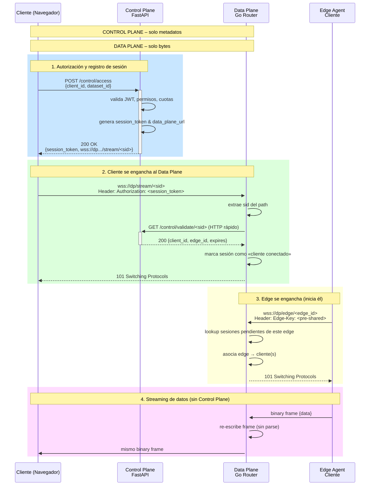
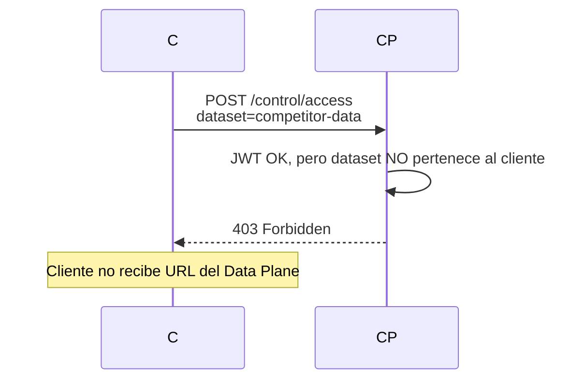

# 🔁 Flujo Completo: Edge → Cliente con Control Plane + Data Plane

A continuación tienes el **diagrama y secuencia paso a paso** que separa **autorización (control)** de **movimiento de bytes (datos)**. El cliente **nunca habla directamente con el edge**; ambos se conectan al **Data Plane Router** que solo **enruta** después de que el **Control Plane** (FastAPI) ha dicho «sí tiene permiso».

---

## 📊 Diagrama de Flujo (Autorización → Streaming)



---

## 🔎 Paso a Paso Detallado

### 1️⃣ Control Plane – Autorización (FastAPI)

```http
POST /control/access
Authorization: Bearer <JWT>
Content-Type: application/json

{
  "client_id": "acme-corp",
  "dataset_id": "factory-01-metrics",
  "requested_ops": ["read"]
}
```

**FastAPI responde:**

```json
200 OK
{
  "session_id": "s-9f3b2e1a",
  "data_plane_url": "wss://dp.saas.com/stream/s-9f3b2e1a",
  "expires_at": "2025-07-21T18:25:43Z",
  "edge_id": "edge-acme-f01"   // qué edge debe conectarse
}
```

**Validaciones internas (Control Plane)**:
- JWT válido
- Cliente tiene plan «Analytics Pro»
- Dataset pertenece al cliente
- Cuota de streams simultáneos no excedida
- Edge `edge-acme-f01` está on-line (heartbeat reciente)

---

### 2️⃣ Data Plane – Cliente se conecta (Go Router)

```javascript
const ws = new WebSocket("wss://dp.saas.com/stream/s-9f3b2e1a");
ws.onopen = () => {
  // Header no se puede poner en browser→WS, enviamos primer frame
  ws.send(JSON.stringify({auth: "s-9f3b2e1a"}));
};
```

**Go Router**:

```go
func (r *DataRouter) HandleBrowser(ws *websocket.Conn, sid string) {
    // 1. Pregunta a Control Plane (HTTP corto, <5 ms)
    info, err := r.cp.Validate(sid) // GET /control/validate/s-9f3b2e1a
    if err != nil {
        ws.Close() // 401
        return
    }
    // 2. Guarda sesión
    r.sessions.Store(sid, &Session{
        clientID:  info.ClientID,
        edgeID:    info.EdgeID,
        browser:   ws,
        edge:      nil, // aún no
    })
}
```

---

### 3️⃣ Data Plane – Edge se conecta

Edge (en infra del cliente) **abre conexión saliente** (cumple firewall):

```bash
wss://dp.saas.com/edge/edge-acme-f01
Header: Edge-Key: <pre-shared-secret>
```

Go Router:

```go
func (r *DataRouter) HandleEdge(ws *websocket.Conn, edgeID string) {
    // 1. Autentica edge (pre-shared key)
    if !r.validateEdge(edgeID, ws.Request().Header.Get("Edge-Key")) {
        ws.Close()
        return
    }
    // 2. Busca sesiones de ese edge
    r.sessions.Range(func(key, value interface{}) bool {
        sess := value.(*Session)
        if sess.edgeID == edgeID && sess.browser != nil {
            sess.edge = ws
            go r.pipe(sess) // ¡enruta!
        }
        return true
    })
}
```

---

### 4️⃣ Data Plane – Streaming puro

```go
func (r *DataRouter) pipe(s *Session) {
    // Copia bytes sin parsear: edge → navegador
    io.Copy(s.browser, s.edge) // latencia ~0
}
```

- **Sin JSON decode/encode** en el router.
- **Sin consultar base de datos**.
- **Sin llamar a Control Plane** mientras fluye.
- Si el frame es > 64 KB, **se fragmenta automáticamente** (WebSockets RFC).

---

## 🛡️ Seguridad y Aislamiento

| Punto | Implementación |
|-------|----------------|
| **Token de sesión** | JWT corto (15 min) firmado por Control Plane; Data Plane solo verifica firma (sin DB). |
| **Edge autenticación** | Pre-shared key por cliente + TLS mutual opcional. |
| **Rate-limit** | Control Plane entrega cuota (ej. 500 MB/h) y Data Plane cuenta bytes; al límite, cierra. |
| **Revocación en caliente** | FastAPI publica en Redis `revoke:s-9f3b2e1a`; Go Router suscribe y cierra inmediato. |

---

## 🧪 Flujo de Error – Acceso Denegado



---

## 🧩 Resumen de Responsabilidades

| **Control Plane (FastAPI)** | **Data Plane (Go Router)** |
|-----------------------------|----------------------------|
| Validar JWT y permisos | Mover bytes edge ↔ cliente |
| Generar session_token | Validar token vs Redis |
| Decidir qué edge usar | Asociar edge con cliente |
| Aplicar cuotas y billing | Cortar stream si se excede cuota |
| Logs de auditoría | Métricas de throughput |
| NO toca datos | NO toca lógica de negocio |

Con esta separación puedes:
- **Escalar Data Plane** (más instancias Go) sin tocar FastAPI.
- **Desplear fixes de autorización** sin downtime de streaming.
- **Cambiar el motor de datos** (Go → Rust → Kafka) sin reescribir tu SaaS.

¿quieres el código de referencia completo del Go Data Router con este flujo?